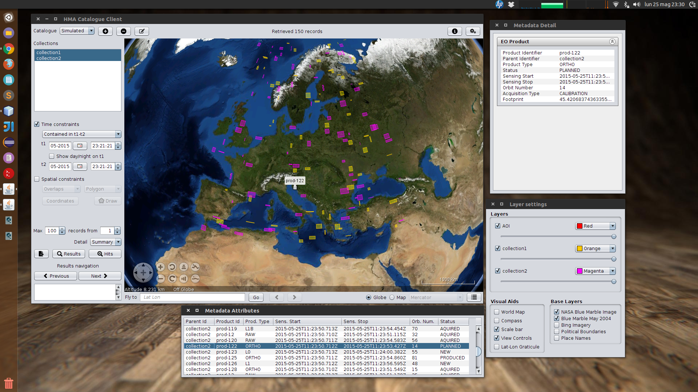

# What is 'hcc' ?

**hcc** is an _HMA Catalogue Client_ application.

[Heterogeneous Missions Accessibility](http://earth.esa.int/hma) (HMA) is a project by the *European Space Agency* to harmonize and standardize the ground segment services and related interfaces of national space agencies, satellite or mission owners and operators.

Within this project a series of data models and protocols have been designed to deal with the typical functionalities of satellite missions ground segments such as catalogue browsing, acquisition feasibility and scheduling, product ordering, ordered product access and so on.

**hcc** deals with catalogue browsing of earth observation product and offers a visual graphic interface for issuing catalogue queries.

--------

## Features

* Definition of catalogue web servicess with name, endpoint URL, timeout and a list of collection strings which may optionally be discoveried connecting to the catalogue service itself (HMA GetCapabilities operation)
* Supported query criteria:
    * Product collections (multiple selection)
    * Time constraints (contained or overlapping a time range, before or after an instant)
    * Spatial constraints (lat/lon range, polyline, polygon, point or cirle areas of interest)
* Visual representation of query product footprints on a 3D globe or 2D map in four projections (uses the [World Wind Java SDK](http://goworldwind.org) )
* Base cartography from widely known map providers (e.g. _NASA Blue Marble_ and _Microsoft Bing_)
* Geographic names and lat/lon graticule overlays
* Results navigation and highlight
* Fly to Lat Lon point with flown-to locations history
* Persistence of catalogue definitions and view settings between invocations
* Several Look & Feels available

--------

## Changelog

### V0.9 25/06/2015

* Switched from NetBeans Ant based build to Maven build
* Added a day and night layer linked to the temporal range start instant
* New grid and detail view of results metadata records
* Dumping of requests/response to file (governed by new preferences settings)
* Windows position and state is remembered between sessions
* Some activity logging to console

--------

## Building

**hcc** is written in Java, this repository contains a multimodule maven project.

### Tools

* Java Development Kit version 7 (developed and tested with Oracle JDK)
* NetBeans IDE (developed and tested with v8.0.2)
* Apache Maven v3.0.5

### Notes

* It's recommended to choose the JDK 7 as default Java Platform for NetBeans, as the projects do not explicitly require a Java 7 platform. If you have NetBeans running on JDK 8 assign a Java Platform explicitly.
* Some binary dependency were included, for developer convenience, by using the _in project maven repository_ technique, where a small maven repository has been embedded in the source tree to let maven fetch the dependencies from the file system the first time.
* The UI makes broad use of swing `GroupLayout` and was built using NetBeans visual designer hence the fenced code blocks and _\*.form_ files scattered here and there. Keep this in mind if editing UI related classes with another IDE.
